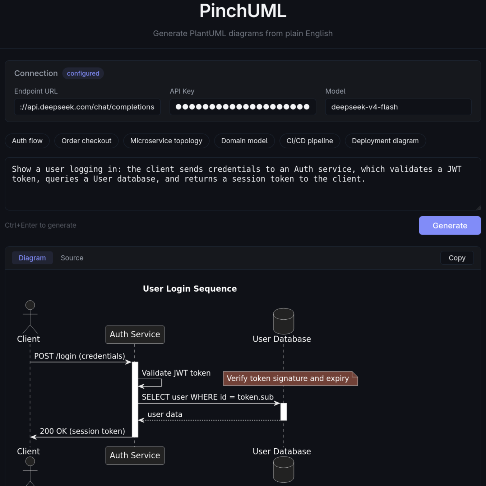
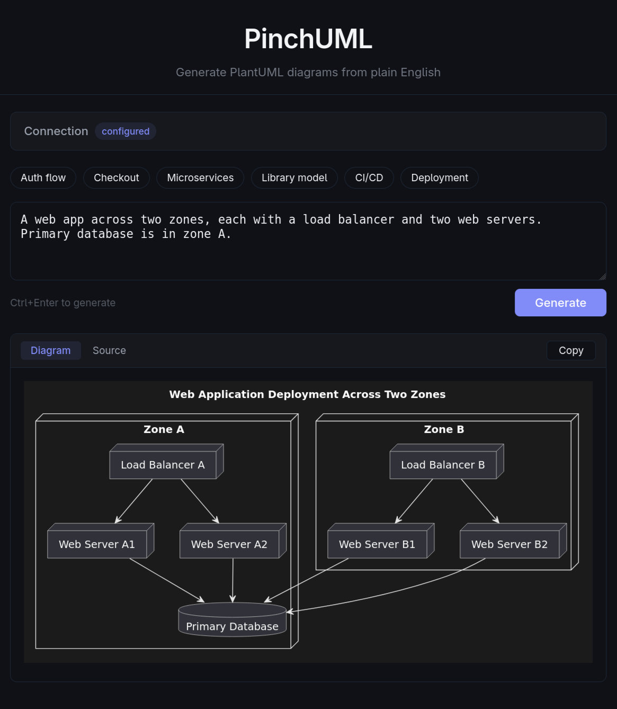

# PinchUML

A browser-first PlantUML editor. Open it, point at any OpenAI-compatible LLM endpoint, and generate diagrams from plain-English scenarios. No server, no setup — your API key never touches a backend you don't control.

---

## What this is about

LLMs are capable of generating PlantUML, but without the right syntax context the output is often naive, syntactically wrong, or visually unappealing. I found myself reaching for the manual every time because the syntax and rules for each diagram type are unique. It was frustrating, yet the potential was clearly there.

PinchUML solves this by mechanically routing the right reference material into the prompt. You type a scenario, the app finds the most relevant syntax docs from the full PlantUML corpus, and feeds them to the LLM as a system prompt. The result: diagrams that are accurate, properly structured, and visually coherent.

This project is also about something broader. AI is practical now in a way it wasn't even a year ago. The tools exist for anyone to build things that would have taken entire teams. The limiting factor is no longer technical capability — it is the ability to spot a real problem, understand the domain, and build a focused solution around it. PinchUML is that process applied to one concrete friction point.

## Samples

| | |
|---|---|
|  |  |

---

## Architecture

### Core principle

The webapp ships with the full PlantUML syntax corpus as precomputed embeddings. The user provides only an LLM endpoint URL.

- **Zero-trust.** The API key never lives in main-thread memory. All API calls (retrieval + generation + retry) run inside a Web Worker. No server, except for the end user's endpoint, ever sees it.
- **BYO-LLM.** Compatible with any OpenAI-style endpoint (Ollama, LM Studio, Groq, etc.).
- **TF-IDF retrieval.** The shipped index uses keyword-based TF-IDF vectors on a 1,485-term vocabulary across 31 syntax reference documents. Well-suited for a focused domain corpus; semantic embeddings would add complexity without proportional gain at this scale.
- **Automatic error recovery.** The rendered SVG is inspected for diagram elements. Syntax errors trigger a fresh retry (up to 2 attempts) with a different random seed.
- **TeaVM rendering.** The full PlantUML engine, compiled from Java to JavaScript, runs entirely in the browser. Requires `viz-global.js` (Graphviz) for layout of component, deployment, and class diagrams.
- **PNG export.** One-click high-resolution export at 3× scale with light-mode rendering, regardless of the user's theme preference.
- **CSP with dynamic endpoint allowlisting.** Starts with `connect-src 'self'` and adds the user's configured LLM endpoint origin at runtime. TeaVM's compiled runtime requires `'unsafe-eval'` and `'unsafe-inline'` in `script-src`.

---

## How it works end-to-end

1. Open the app, enter your LLM endpoint URL + API key + model name.
2. Type a scenario or click a demo chip: e.g., *"Show a user logging in via an auth service that validates a JWT and queries a database."*
3. Press Ctrl+Enter.
4. The Web Worker loads the precomputed TF-IDF index, embeds your scenario, retrieves the top-3 most relevant syntax documents, builds a strict system prompt, and calls your LLM endpoint.
5. The returned PlantUML code renders as SVG in-browser via the TeaVM engine.
6. If the renderer detects a syntax error, the code + error is sent back to the LLM for a fix (up to 2 retries). The spinner shows "Fixing syntax error…" during retries.
7. Toggle between Diagram and Source views. Copy the PlantUML source to clipboard.

---

## Repository layout

```
pinchuml/
├── shell/                       # The webapp
│   ├── public/
│   │   ├── teavm/js/
│   │   │   ├── plantuml.js      # TeaVM PlantUML → SVG renderer (loaded at runtime)
│   │   │   ├── viz-global.js    # Graphviz library
│   │   │   └── *.min.js         # Sprite libraries (AWS, Azure, C4, K8s, etc.)
│   │   ├── embeddings-index.json # Precomputed TF-IDF vectors (482 KB, 31 docs)
│   │   └── favicon.svg
│   ├── src/
│   │   ├── components/
│   │   │   ├── ConnectionPanel.tsx  # Endpoint/API key/model (collapsible, persisted)
│   │   │   ├── DemoTiles.tsx        # Clickable demo scenario chips
│   │   │   ├── DiagramView.tsx      # SVG render + source toggle + copy + error detection
│   │   │   └── PromptInput.tsx      # Textarea with Ctrl+Enter shortcut
│   │   ├── rag.ts              # TF-IDF retrieval engine (runs in worker)
│   │   ├── worker.ts           # Web Worker — all API calls + RAG run here
│   │   ├── csp.ts              # Dynamic CSP management
│   │   ├── demos.ts            # 6 built-in demo scenarios
│   │   ├── types.ts            # Shared TypeScript types
│   │   ├── App.tsx             # State management, worker lifecycle, retry loop
│   │   ├── App.css             # Component styles
│   │   ├── index.css           # Global styles + CSS variables (light/dark)
│   │   └── main.tsx            # Entry point, CSP init
│   ├── scripts/
│   │   └── generate-embeddings.mjs  # Build-time TF-IDF indexer
│   ├── index.html              # CSP meta tag, app shell
│   ├── vite.config.ts
│   └── package.json
│
└── mind/                       # Developer workspace (not distributed)
    ├── memory/
    │   ├── *.md                # 31 preprocessed PlantUML syntax references (RAG corpus)
    │   └── 2026-05-26.md       # Session log
    └── AGENTS.md / SOUL.md / TOOLS.md ...
```

---

## Timeline

| Date | Change | Branch |
|---|---|---|
| 2026-05-26 | Project setup — scaffold, types, demos, layout | `feat/project-setup` |
| 2026-05-26 | RAG pipeline — TF-IDF indexer + retrieval engine | `feat/rag-pipeline` |
| 2026-05-26 | Web Worker — API key isolation | `feat/web-worker` |
| 2026-05-26 | UI components — all four + TeaVM rendering | `feat/app-ui` |
| 2026-05-26 | Security — CSP, dynamic endpoint allowlisting, validation | `feat/security` |
| 2026-05-26 | Fix: Vite public/ import in dev mode | `fix/public-import` |
| 2026-05-26 | Auto-retry on render errors (max 2, fresh generation) | `feat/retry-on-error` |
| 2026-05-26 | Fix: TeaVM needs unsafe-eval + unsafe-inline in CSP | `fix/csp-teavm`, `fix/csp-inline` |
| 2026-05-26 | Fix: toggle preserves SVG, retry shows spinner | `fix/toggle-and-retry-ui` |
| 2026-05-26 | Tightened system prompt — diagram type selection guide | `fix/tighten-prompt` |
| 2026-05-26 | Activity diagram prompt — single start/stop, no duplication | `fix/activity-prompt` |
| 2026-05-26 | Keyword-boosted retrieval with penalties + force-include | `fix/retrieval-boosting` |
| 2026-05-26 | Surface full PlantUML error text + stronger boosts | `fix/error-detection-boost` |
| 2026-05-26 | Boost keys matched to actual doc filenames | `fix/boost-keys` |
| 2026-05-26 | Wire TeaVM $jsException crashes into retry flow | `fix/teavm-crash-detection` |
| 2026-05-26 | Simpler demos, 8K token budget | `fix/demos-retry-tokens` |
| 2026-05-26 | Test harness + penalty system for RAG retrieval | `feat/debug-panel` |
| 2026-05-26 | Fix: TeaVM needs viz-global.js (Graphviz) for all diagram types | `fix/isolate-teavm-crash` |
| 2026-05-26 | PNG export — 3x canvas render, one-click download | `feat/png-export` |

---

## Development

```bash
cd shell
npm install
npm run dev        # Dev server on localhost:5173
npm run build      # Production build → dist/
npm run lint       # ESLint
npx tsc --noEmit   # Type check
```

To regenerate the TF-IDF index after updating the syntax corpus:

```bash
node scripts/generate-embeddings.mjs
```
